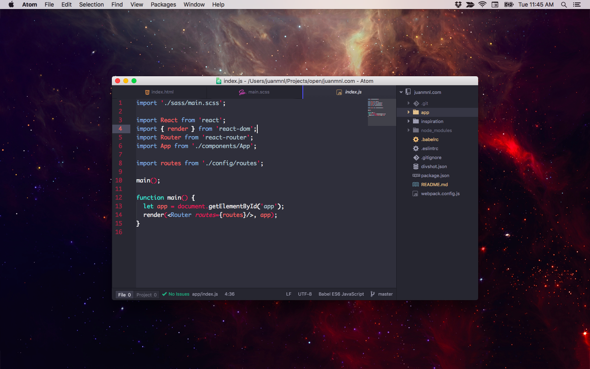
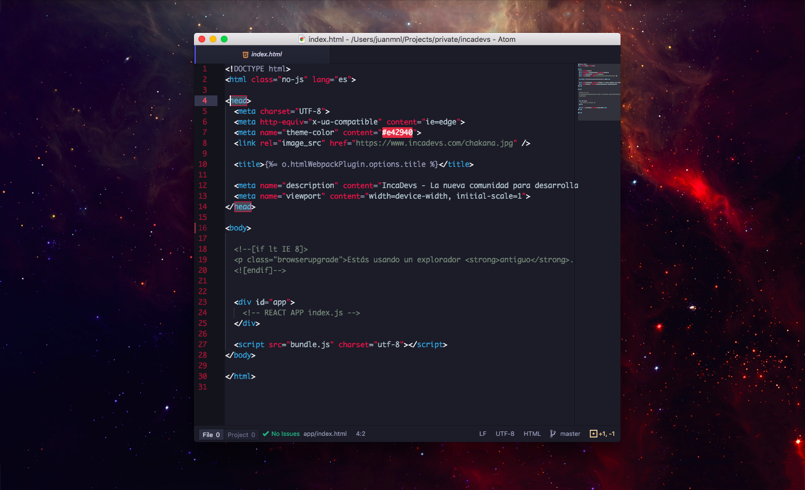
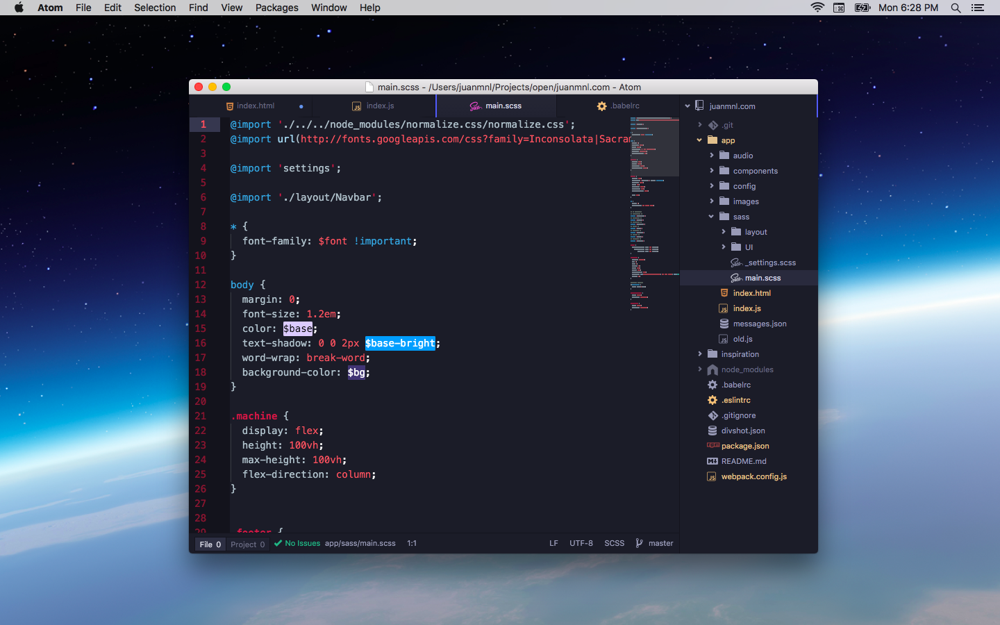

# Hydra Syntax Theme

Hail Hydra!

**Use with Atom's One Dark UI theme.**

:fire: v1.0.0 is here! :fire:

## Screens

ES6 (w/babel)

HTML

SASS

Open Atom Preferences > Themes > Search: `hydra`,
then Install.

*You may need to reload Atom `Cmd+R` in between these steps.*
Activate the theme by selecting the Themes section of Preferences.
